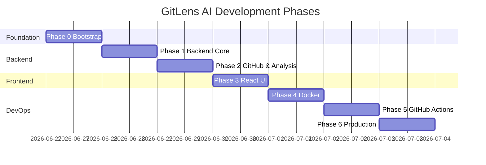

# GitLens AI — Development Plan

Phased roadmap from empty repo to a Dockerized, CI-tested, deployable MVP.

**Estimated total time:** 3–5 days (learning pace)

---

## Phase 0 — Project Bootstrap (½ day)

**Goal:** Scaffold repo, no feature logic yet.

### Tasks

- [ ] Initialize git repository
- [ ] Create folder structure (see [FOLDER_STRUCTURE.md](FOLDER_STRUCTURE.md))
- [ ] Add root `README.md`, `.gitignore`, docs
- [ ] Create `.env.example` files for frontend and backend
- [ ] Verify directory layout matches architecture doc

### Done when

- Repo clones cleanly; all folders exist with README placeholders
- Team (you) can navigate docs and understand the plan

---

## Phase 1 — Backend Core (1 day)

**Goal:** Working FastAPI app with health check and MongoDB connection.

### Tasks

1. **Config & app shell**
   - [ ] `core/config.py` — `Settings` from env vars
   - [ ] `main.py` — FastAPI app, lifespan (Motor connect/disconnect), CORS
   - [ ] `api/v1/endpoints/health.py` — `/health`, `/health/ready`

2. **Database layer**
   - [ ] `db/mongodb.py` — Motor client singleton
   - [ ] `db/analysis_repository.py` — `upsert`, `find_by_username`

3. **Schemas & models**
   - [ ] `schemas/analyze.py` — `AnalyzeRequest`
   - [ ] `schemas/analysis.py` — full `AnalysisResponse` tree
   - [ ] `models/analysis.py` — document shape for MongoDB

4. **Local MongoDB**
   - [ ] Run MongoDB locally or via `docker compose` (mongo only)
   - [ ] Confirm `/health/ready` returns 200 when DB is up

### Done when

- `uvicorn main:app --reload` starts without errors
- `/docs` shows OpenAPI UI
- `/health/ready` pings MongoDB successfully

### Learning focus

- FastAPI lifespan events
- Pydantic v2 settings
- Motor async patterns

---

## Phase 2 — GitHub Integration & Analysis (1 day)

**Goal:** Implement the core analyze pipeline end-to-end (API only).

### Tasks

1. **GitHub client**
   - [ ] `services/github_service.py` — fetch user + repos via httpx
   - [ ] `utils/github.py` — username validation
   - [ ] `core/exceptions.py` — `UserNotFoundError`, `GitHubAPIError`

2. **Analysis logic**
   - [ ] `services/analysis_service.py`:
     - Top 5 repos by `stargazers_count`
     - Aggregate languages from repos
     - Sum total stars and forks

3. **Roast engine**
   - [ ] `services/roast_service.py` — rule list from [ARCHITECTURE.md](ARCHITECTURE.md)

4. **API endpoints**
   - [ ] `POST /api/v1/analyze` — orchestrate services, persist, return
   - [ ] `GET /api/v1/analyses/{username}` — read from MongoDB

5. **Tests**
   - [ ] Mock GitHub responses in `tests/test_analyze.py`
   - [ ] Unit tests for roast rules in `tests/test_roast_service.py`

### Done when

- `curl -X POST localhost:8000/api/v1/analyze -d '{"username":"octocat"}'` returns full JSON
- Second call returns cached data via GET
- Tests pass with `pytest`

### Learning focus

- Service layer separation
- Error mapping (GitHub 404 → API 404)
- Testing with mocks

---

## Phase 3 — Frontend (1 day)

**Goal:** React UI for Home and Dashboard pages.

### Tasks

1. **Vite + Tailwind setup**
   - [ ] Scaffold with `npm create vite@latest`
   - [ ] Configure Tailwind, path aliases if desired

2. **Types & API layer**
   - [ ] `types/analysis.ts` — mirror backend schemas
   - [ ] `services/api.ts` + `analysisService.ts`

3. **Hooks**
   - [ ] `useAnalyze` — POST, handle loading/error, navigate on success
   - [ ] `useAnalysis` — GET for dashboard

4. **Pages & components**
   - [ ] `HomePage` + `UsernameForm` + `LoadingSpinner`
   - [ ] `DashboardPage` — compose ProfileHeader, StatCards, RepoList, LanguageChart, RoastBanner
   - [ ] `MainLayout` — simple header with app name
   - [ ] `NotFoundPage`

5. **Routing**
   - [ ] React Router: `/`, `/dashboard/:username`, `*`

6. **Polish**
   - [ ] Loading and error states on both pages
   - [ ] Basic responsive layout (mobile-friendly grid)

### Done when

- User can enter username → see dashboard with all MVP fields
- Errors (invalid user, network) show friendly messages
- `npm run build` succeeds

### Learning focus

- React hooks and component composition
- React Router v6
- Axios + TypeScript types

---

## Phase 4 — Docker & Compose (½ day)

**Goal:** Full stack runs with one command.

### Tasks

- [ ] `docker/Dockerfile.backend` — multi-stage, non-root user
- [ ] `docker/Dockerfile.frontend` — build + nginx
- [ ] `docker/nginx/default.conf` — SPA fallback
- [ ] `docker/docker-compose.yml` — frontend, backend, mongodb
- [ ] Wire env vars via compose `environment` / `.env`
- [ ] Add `HEALTHCHECK` to backend container
- [ ] Document commands in `docker/README.md`

### Done when

```bash
docker compose -f docker/docker-compose.yml up --build
```

- Frontend loads at `http://localhost:5173` (or mapped port)
- Analyze flow works through Dockerized stack
- MongoDB data persists via named volume

### Learning focus

- Multi-stage Docker builds
- Service discovery (`mongodb` hostname)
- Build-time vs runtime env (`VITE_API_URL`)

---

## Phase 5 — GitHub Actions CI (½ day)

**Goal:** Automated checks on every push/PR.

### Tasks

- [ ] `.github/workflows/ci.yml`:
  - **Job 1:** Backend — install, ruff, pytest (with MongoDB service container)
  - **Job 2:** Frontend — npm ci, lint, build
  - **Job 3:** Docker — build both images (smoke test optional)

- [ ] Add status badge to root README
- [ ] Fix any CI failures (pin Node/Python versions)

### Done when

- Green CI on `main` branch
- PRs show passing checks before merge

### Learning focus

- GitHub Actions syntax (`on`, `jobs`, `steps`, `services`)
- Matrix vs parallel jobs
- Caching (`actions/cache`) — optional optimization

---

## Phase 6 — Production Hardening (½ day, optional)

**Goal:** Light production practices without over-engineering.

### Tasks

- [ ] `docker-compose.prod.yml` — no dev volumes, restart policies
- [ ] Structured logging in backend (request ID optional)
- [ ] README deployment section (single VPS, Railway, Render, or Fly.io)
- [ ] Optional `cd.yml` — push images to GHCR on version tag
- [ ] Optional `GH_PAT` support for higher API limits

### Done when

- App deployable to one cloud target with documented steps
- Production compose file runs stable for 24h without issues

---

## Implementation Order Diagram



---

## Testing Strategy

| Layer | What to test | Tool |
|-------|--------------|------|
| Roast rules | Pure functions, edge cases | pytest |
| Analysis stats | Mock repo list input | pytest |
| API endpoints | Mock GitHub + mock DB | pytest + httpx |
| Frontend | Manual MVP; optional Vitest later | Browser |

**CI rule:** No live GitHub API calls in automated tests (flaky + rate limits).

---

## Stretch Goals (after MVP)

1. Pagination for users with 100+ repos
2. Simple history: list last 10 analyses
3. Dark mode toggle
4. GitHub OAuth (if you want to learn auth separately)
5. Deploy preview environments per PR

---

## Definition of Done (MVP)

- [ ] User can analyze any public GitHub username
- [ ] Dashboard shows all required fields + roast
- [ ] Analysis persisted in MongoDB
- [ ] Full stack runs via Docker Compose
- [ ] CI passes on GitHub Actions
- [ ] README documents local dev and Docker usage

When all boxes are checked, you have a portfolio-ready learning project that demonstrates real full-stack and DevOps patterns.
